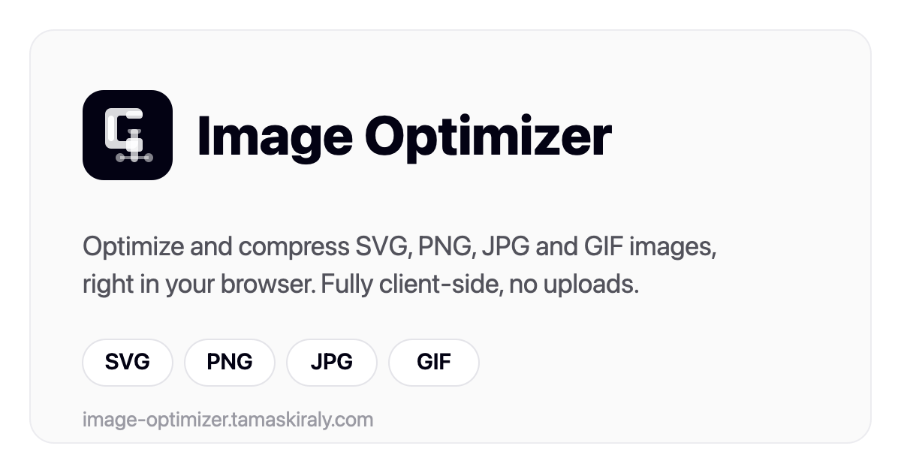

# Image Optimizer



A browser-based tool for optimizing SVGs and compressing JPG, PNG, and GIF images. Everything runs locally in the browser, so files are never uploaded to a server.

**Live:** https://image-optimizer.tamaskiraly.com

## What it does

Drop in one file or a few dozen. The app picks the right optimizer for each file type, shows the before and after sizes, and lets you download the results one by one or as a single ZIP.

- **SVG.** Removes editor leftovers (Inkscape and Sodipodi attributes, metadata, comments, empty groups, and `display:none` layers) and leaves alone anything referenced by `id`, sitting inside `<defs>`, or otherwise able to change how the file renders. It collapses whitespace in path data but never rounds coordinates, so curves stay exactly where the designer put them.
- **JPG.** Quality-based compression with an optional toggle to keep EXIF data. There is a quality-cascade fallback for Safari, whose canvas encoder sometimes ignores the quality value.
- **PNG.** Lossy or lossless compression, plus an optional maximum width or height for downscaling.
- **GIF.** Animated files are re-encoded frame by frame; static ones are converted to PNG. Resizing is optional.

A few other things worth knowing:

- Add files by dragging them in, clicking to browse, or pasting from the clipboard (Ctrl/Cmd+V). SVG can also be pasted as raw code.
- Any raster image can be converted to WebP instead of keeping its original format.
- It processes files in parallel and shows running totals: file count by type, original size, optimized size, and how much you saved.
- It won't hand back a file that came out larger than the original, unless you asked it to change the format or the dimensions.
- Light and dark themes, remembered between visits.

## Privacy

There is no backend. Images are read, compressed, and downloaded entirely on the client using the Canvas API, `browser-image-compression`, and a couple of small GIF libraries. Nothing is uploaded, and the optimizing itself needs no network connection.

## Tech stack

- React 18 and TypeScript
- Vite 6
- Tailwind CSS v4
- Motion for animations, Iconoir for icons
- `browser-image-compression`, `gifenc`, and `gifuct-js` for encoding; `jszip` for the bulk download

## Getting started

Requires Node 18 or newer.

```bash
npm install      # install dependencies
npm run dev      # start the dev server (http://localhost:5173 by default)
npm run build    # production build into dist/
npm run preview  # serve the built output locally
```

## Project structure

```
src/
  main.tsx                       # entry point
  app/
    App.tsx                      # state, file handling, layout
    components/
      drop-zone.tsx              # drag/drop, browse, paste
      svg-optimizer.ts           # SVG parsing and cleanup
      image-optimizer.ts         # JPG/PNG/WebP compression (Canvas + browser-image-compression)
      gif-optimizer.ts           # animated GIF re-encoding
      compression-settings.tsx   # quality, resize, and format controls
      svg-result-card.tsx        # per-file before/after UI
      image-result-card.tsx
  styles/                        # Tailwind entry and theme tokens
public/                          # favicon and social image
```

## Deployment

Hosted on Vercel with the GitHub repo connected, so every push to `main` builds and deploys on its own. To trigger a production deploy by hand:

```bash
vercel deploy --prod
```

## Author

Built by Tamás Király (Tommy K). See [tamaskiraly.com](https://tamaskiraly.com). Personal project.
